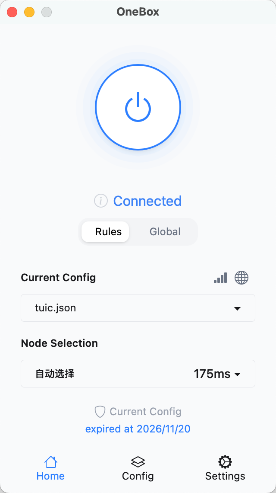
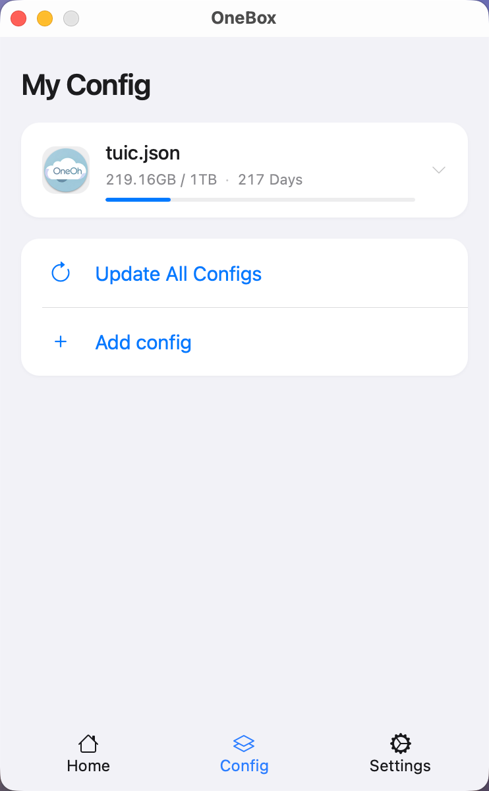
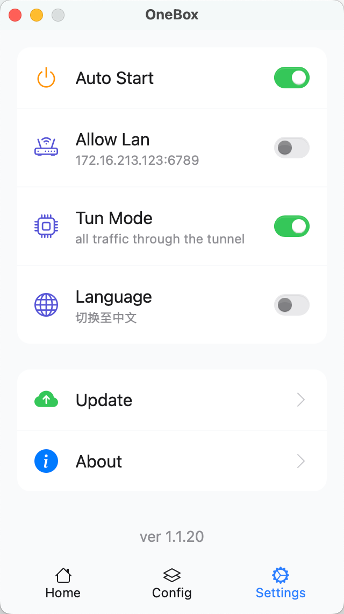

# OneBox

[简体中文](./README_CN.md)

[](https://github.com/OneOhCloud/OneBox/actions/workflows/dev-release.yml)
[](https://github.com/OneOhCloud/OneBox/actions/workflows/beta-release.yml)
[](https://github.com/OneOhCloud/OneBox/actions/workflows/stable-release.yml)
[](https://github.com/SagerNet/sing-box)

A cross-platform GUI client based on [sing-box](https://github.com/SagerNet/sing-box) kernel, targeting ordinary users. For those who prefer complex configurations and tinkering, please refer to other projects.

---

## Table of Contents

- [Introduction](#introduction)
- [Screenshots](#screenshots)
- [Project Objectives](#project-objectives)
- [Key Features](#key-features)
- [Platform Support](#platform-support)
- [Download and Installation](#download-and-installation)
- [Support Level Explanation](#support-level-explanation)

---

## Screenshots

||||
|:---:|:---:|:---:|

---

## Project Objectives

**Simplicity, Stability, Security. No complex configuration, ready to use out of the box.**

---

## Key Features

- **Performance**: Developed in Rust, ensuring excellent performance and low resource consumption.
- **Security & Privacy**: Implements best practices for security and privacy, such as storing sensitive information like passwords in the system keychain.
- **Trusted Installation**: The macOS version is notarized by Apple, allowing direct installation without complicated authorization.

> [!WARNING]
> While we have implemented multiple security measures, the security and vulnerability fixes of the underlying kernel depend on the sing-box project, and the associated risks and fixes are not directly controlled by this project.

---

## Platform Support

- **Tier 1 (Fully Supported)**: macOS
- **Tier 2 (Community Supported)**: Windows
- **Tier 3 (Experimental)**: Linux

---

## Download and Installation

Please visit our [releases page](https://github.com/OneOhCloud/OneBox/releases) to get the latest version.

---

## Test 

To run tests with output displayed in the console, use the following command:

```rust
cargo test  -- --nocapture 
```

## Support Level Explanation

- **Tier 1 (Fully Supported)**: Officially and actively maintained by the core team. All features are available, and issues are prioritized for fixes. Best user experience.
- **Tier 2 (Community Supported)**: Mainly maintained by community contributors. Some features may be limited, and official support is not guaranteed. Issues are addressed as community resources allow.
- **Tier 3 (Experimental)**: Early or experimental support. Features may be incomplete or unstable, and there is no guarantee of timely fixes or updates.

---