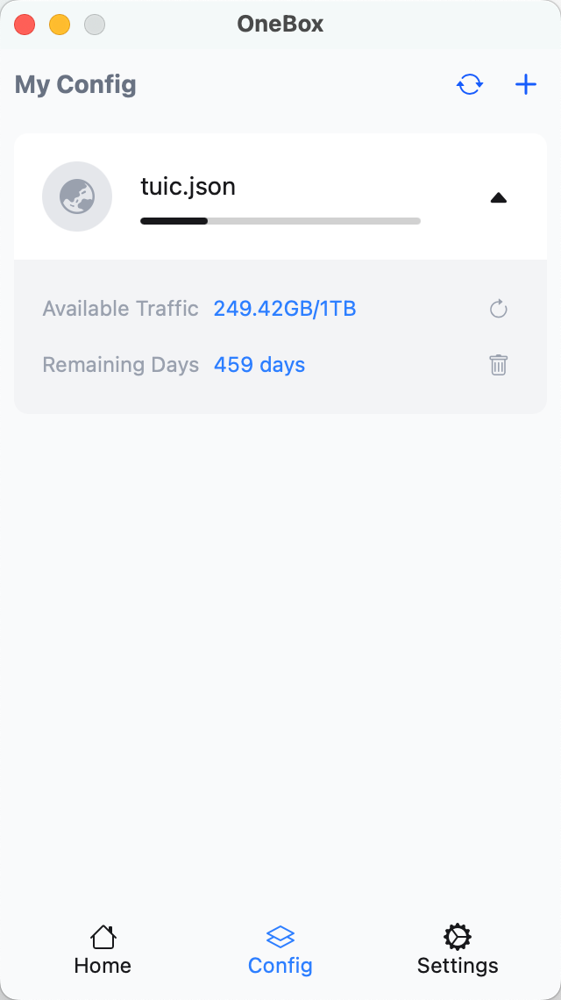

# OneBox ｜ [简体中文](./README_CN.md)

A cross-platform GUI client based on sing-box kernel.

## Why Create This Project? ✨

In today's fast-paced life, we deeply understand the value of time. While many third-party open-source projects available in the market are feature-rich, they often tend to be overly professional, offering numerous advanced features that ordinary users might never use. This not only increases the learning curve but also consumes valuable time in research and configuration.

We firmly believe that tools should serve efficiency rather than becoming obstacles to it. In OneBox, we adhere to the design philosophy of "simplicity first, ready to use out of the box," committed to letting users focus their time on what truly matters instead of wasting it on endless configuration and debugging. We have carefully selected the most practical core features, presenting them in the most concise way possible, allowing you to use it immediately and return to the essence of your work.

If you are a professional user who is passionate about deep customization and technical exploration, we recommend considering these excellent open-source projects:

- https://github.com/libnyanpasu/clash-nyanpasu
- https://github.com/clash-verge-rev/clash-verge-rev
- https://github.com/2dust/v2rayN

## Screenshots

||||
|:---:|:---:|:---:|

## Download and Installation

Please visit our [releases page](https://github.com/OneOhCloud/OneBox/releases) to get the latest version.