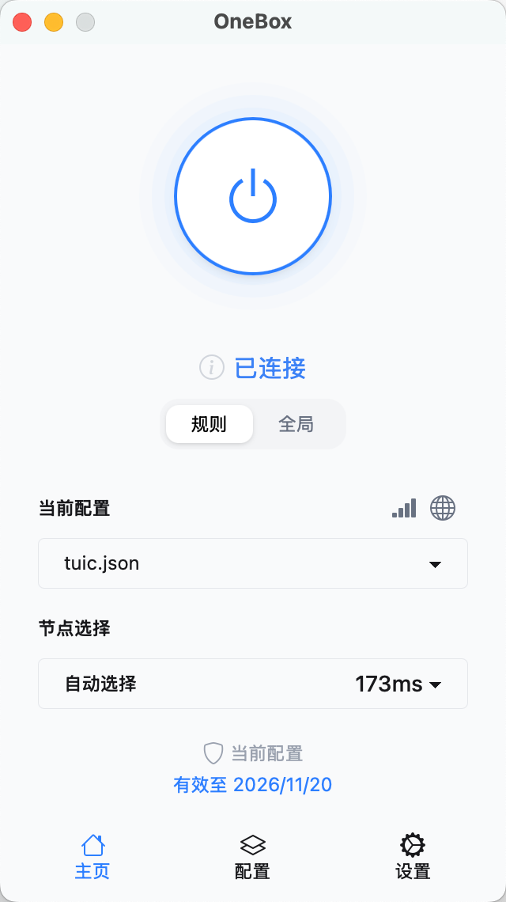

# OneBox

基于 sing-box 内核的跨平台 GUI 客户端。

## 为什么创建这个项目？ ✨

在当今快节奏的生活中，我们深知时间的宝贵。市面上的许多第三方开源项目虽然功能丰富，但往往过于专业化，提供了大量对普通用户而言可能永远不会用到的高级功能。这不仅增加了学习成本，更会占用宝贵的时间去研究和配置。

我们坚信：工具本应该为效率服务，而不是成为效率的绊脚石。在 OneBox 中，我们秉持"简约至上，开箱即用"的设计理念，致力于让用户将时间专注在真正重要的事情上，而不是浪费在无休止的配置和调试中。我们精心筛选了最实用的核心功能，以最简洁的方式呈现，让您能够即开即用，回归工作本质。

如果您是专业用户，热衷于深度定制和技术探索，我们建议您考虑以下优秀的开源项目：

- https://github.com/libnyanpasu/clash-nyanpasu
- https://github.com/clash-verge-rev/clash-verge-rev
- https://github.com/2dust/v2rayN

## 软件截图 

||||
|:---:|:---:|:---:|

## 下载安装 

请访问我们的[发布页面](https://github.com/OneOhCloud/OneBox/releases)获取最新版本。

