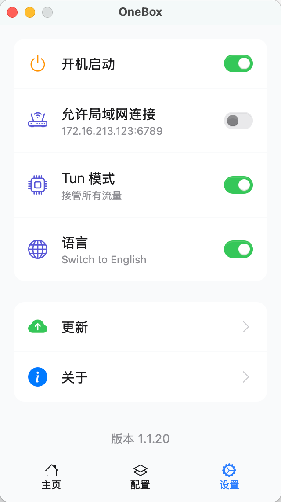

# OneBox

基于 [sing-box](https://github.com/SagerNet/sing-box) 内核的跨平台 GUI 客户端，专为追求简洁易用的普通用户设计。如果你偏好复杂配置和深度折腾，建议选择其他项目。

---

## 目录

- [简介](#简介)
- [软件截图](#软件截图)
- [核心宗旨](#核心宗旨)
- [特色功能](#特色功能)
- [平台支持](#平台支持)
- [下载安装](#下载安装)
- [支持级别说明](#支持级别说明)

---

## 简介

基于 [sing-box](https://github.com/SagerNet/sing-box) 内核的跨平台 GUI 客户端，专为追求简洁易用的普通用户设计。如果你偏好复杂配置和深度折腾，建议选择其他项目。

## 软件截图

||||
|:---:|:---:|:---:|

---

## 核心宗旨

**简单、稳定、安全。无需繁琐配置，开箱即用。**

---

## 特色功能

- **安全高效**：采用安全的 Rust 语言开发，性能优异且资源占用低。
- **隐私保护**：使用安全与隐私保护最佳实践，如密码等机密信息存储在系统钥匙串中。
- **可信安装**：macOS 版本已通过苹果官方公证，可直接下载安装，无需繁琐授权。

> [!WARNING]
> 我们已采取多项安全措施，但底层内核的安全性及漏洞修复依赖于 sing-box 项目，相关风险和修复并非本项目可直接控制。

---

## 平台支持

- **Tier 1（完全支持）**：macOS
- **Tier 2（社区支持）**：Windows
- **Tier 3（实验性）**：Linux

---

## 下载安装

请访问我们的 [发布页面](https://github.com/OneOhCloud/OneBox/releases) 获取最新版本。

---

## 支持级别说明

- **Tier 1（完全支持）**：由核心团队官方维护，功能最完整，遇到问题会优先修复，用户体验最佳。
- **Tier 2（社区支持）**：主要由社区成员维护，部分功能可能有限，官方不保证全部支持，问题修复依赖社区资源。
- **Tier 3（实验性）**：处于早期或实验阶段，功能可能不完整或不稳定，不保证及时修复和更新。

---

